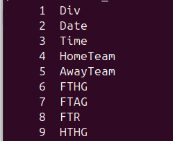

# Chapter 2 - Getting and Prepping the data for loading

Finding the data we need, checking it, cleaning it and preparing it for database upload can be thankless, onerous and tedious. The data we need is often scattered across multiple source files and the formats of those files may be incompatible. Frequently data is missing or unusable. All these factors combine to make data management and data analysis much more challenging than is often appreciated.

Our objective in this chapter is to collect all the data for English Premier League (EPL) football (aka soccer in some varieties of English) games from the inaugural 1992-1993 EPL season to the season 2023-2024. I already gave some background on football in general and the EPL in particular in the introduction so I am assuming you know what I am talking about when I say things like "EPL" and "seasons".

This chapter uses some reasonably advanced shell scripting. Anyone who knows basic programming and has at least some shell programming experience should be able to follow along. I use the bash shell in all my examples; it is a commonly used shell and is standard on Linux. There is a range of shells to choose from, the modern Mac uses zsh (Z shell) by default but if you use the bash shebang line, your script will be executed by bash. In addition to the variety of shells, another complication of shell scripting is that the utilities that the shell uses might differ; for example, the text match and filter utility _grep_ on one platform might be implemented as _egrep_ on another platform. That said, a few tweaks or a Google search can usually fix things.

If you aren not interested in this topic and just want to get to the DuckDB stuff, then you can skip ahead to the next chapter. The DuckDB load files have already been generated and are available in the repo directory _output_data_. Also, if you are proficient in say Ruby or Python and prefer those tools to shell, by all means go ahead and use them instead of shell if you prefer. Windows users who are familiar with PowerShell might also prefer that tool instead. To repeat what I said in the introduction, I like and value shell programming but opinions differ. 

## Task overview

I have downloaded 31 files covering the EPL season 1993-1994 to 20123-24. These are comma-separated values (CSV) files and we want to extract only a subset of columns from each file and then concatenate all 21 files together into a tab-separated file that we will load into a DuckDB database. As the source files were built over the seasons, new columns have been added over time. Most new columns have been added to the right and we are ignoring them. More recent season files have an additional column that records the match start time which has been inserted between columns we need to retain so we will need to account for it in our parsing code. I have a different file format entirely for the inaugural 1992-1993 season that we will process in the DuckDB database itself and then add to the final analysis-ready table.


## Before we start

I assuming the following:

- You have access to a Unix type terminal; it could be Mac OS X, Linux, Unix or a linux emulator on windows such as Wine or Windows Subsystem for Linux (WSL)
- You have checked out the GitHub repo

## The source data

### Seasons 1993-1994 to 2023-2024

I found all the data for seasons from 1993-1994 to 2013-2024 on the website [Football-Data.co.uk](https://www.football-data.co.uk/englandm.php). The site provides a guide to the data in a _notes.txt_ file at [this link](https://www.football-data.co.uk/notes.txt). Each EPL season's results has a link to a downloadable CSV file. Each season's CSV file is called __E0.csv__ so after downloading each one, I re-named them using the format season start year, followed by underscore, followed by the season end year followed by .csv; an example file name I have assigned is _2003_2004.csv_.

Tip: Consistent file naming really helps to keep things organised and also makes processing of such files using shell scripts much easier as we will see below.

31 such files were downloaded, renamed and stored in the repo directory named _source_files_.

### Season 1992-1993

Unfortunately, data for the very first EPL season was not avaialble on the website I refer to above. It seemed a shame to me not to have data for the very first EPL season so I found it on Wikipedia, [1992–93 FA Premier League](https://en.wikipedia.org/wiki/1992%E2%80%9393_FA_Premier_League).

I located the match results in a section called unsurprisingly "Results". I created a CSV file version of this table using Google Sheets which provides a very handy function called _IMPORTHTML_. The following formula entered in cell A1 of Sheet1 extracts the Wikipedia table into the spreadsheet. 

`=IMPORTHTML("https://en.wikipedia.org/wiki/1992%E2%80%9393_FA_Premier_League", "table", 6)`

Note: you may be prompted to authorise the call to an external resource

I then downloaded the sheet as a tab-delimited CSV file using the menu action:

`File->Download->Tab-separated values (.tsv)`

I saved the file as _season_1992_1993.tsv_ in the repo directory _source_data_. 

When working with real world data, it is valuable to have skills in a wide range of tools. Google Sheets is an excellent application with lots of really useful functions such as _IMPORTHTML_ which we have used above. It is also compatible with Excel and it plays nicely with DuckDB.

The downloaded file is in what is often described as a "crosstab" format which is not convenient for querying. In order to  extract the data from it, we will need to do some manipulation to create a "long" format with each club name and home and away scores in separate columns. We are also missing the match date so when we integrate data for this season with the later seasons from the previous step, we will have missing data. Missing data is a common occurrence in the real world and we will discuss how to deal with it when we have the data in DuckDB tables.


## Builing our shell script piece by piece

The final shell script is available in the _shell_scripts_ directory of the project repo and is named _parse_seasons_1993_2023.sh_. You can take a look at it now to get an overview of it but I am going to break it down piece by piece and explain what each segment of it achieves so that by the end, you will hopefully have a good understanding of its workings. Shell scripting is very amenable to this building piece by piece approach because it is really a glue for the wide range of programs and utilities available on modern Unix-type systems. If you use Unix utilities, then you can write shell scripts by just putting the commands in a script file that you then make executable. Our script file starts with the _shebang_ line: `#!/usr/bin/bash`. When we execute the script by entering `./parse_seasons_1993_2023.sh`, in the command line, it starts executing the lines in the file either line by line or by construct when you have compound statements such as loops and _if_ statements.

Each section of the script is introduced with an explanatory comment that begins with # and extends to the line end.

### Declare some variables

The script does not take any arguments when it is run; everything it needs to know is contained within the script itself. The input and out directory paths are assigned to variables as relative paths, relative to the directory of the script itself, that is.

```sh
# Declare variables.
OUTPUT_DIR="../output_data/"
INPUT_DIR="../source_data/"
```

Using variables in place of hard-coded values allows us to change either path in one just place; this is good practice. Note also that the double quotes are required and you cannot have any spaces around the assignment = sign; the requirement not to have spaces around the = is a shell script oddity and frequent source of potentially nasty code bugs.

### Delete the output file

If the output file was generated previously, we want to delete it and start fresh. The following shell construct checks if the file exists, if it does, it deletes it. The relevant bash construct is as follows:

```sh
# Remove the final output file if it already exists.
if [[ -f ${OUTPUT_DIR}seasons_1993_2023.tsv ]]; then
  rm ${OUTPUT_DIR}seasons_1993_2023.tsv 
fi
```

The bash _if_ syntax looks strange with its double square brackets but the _-f_ is a simple file test and returns _true_ if the given file exists. The dollar is required when accessing the value assigned to a shell variable. The braces ({}) are included to delimit the shell variable. Without the braces, the shell would erroneously assume the variable name includes the text "seasons_1993_2023.tsv"; if you  are accessing the value of a variable name that is bounded by white space, then the curly braces are not needed. Forgetting to use the dollar sign when accessing the variable's value and omitting the curly braces when they are need are two frequent sources of shell script bugs!

 The body of the _if_ statement contains a single command to remove ( _rm_ ) the file. We could simply issue the _rm_ command without enclosing it in the _if_ construct but an error would be written to the terminal as standard error if the file did not exist so wrapping it in an _if_ is slightly cleaner.


### Parse files that do not have the match time column

Let's take a close look at this code segment because it is relatively complex and it demostrates the real power of shell scripting. It uses the powerful _sed_ and _awk_ utilities which are two trusty old power tools of Unix scripting. I have broken up the commands using the shell line continuation backslash character to make the lines shorter and hopefully more readable.

```sh
# Parse the files which *do not have* the match time column.
for FILE in ${INPUT_DIR}{1993..2018}*.csv
do
  sed '1d' $FILE | \
    awk -v season=$(basename $FILE | sed 's/.csv//') -v null='NA' \
      'BEGIN{FS=","; OFS="\t"}{print season,$2,null,$3,$4,$5,$6}' \
         >>seasons_1993_2018.tsv
done
```

We already discussed the importance of consistent naming of files to make file processing easier and here we see an example of it. In the _for_ loop above we are using _brace expansion_ to create a list of all CSV files beginning with the numbers in the range 1993 up to and including 2018. Each iteration of the loop assigns the relative file path to the variable _FILE_. The `sed '1d' $FILE` command deletes the first line from the file (the column names row) and sends all remaining lines to the _awk_ command using the pipe symbol (|). In shell scripting parlance, we say a command _pipes_ its output to another command. 

The _awk_ code is the most complex so let's break it down:

- `-v season=$(basename $FILE | sed 's/.csv//')`: This creates an _awk_ variable called _season_ which we want to include in the output file. For each file processed in the loop, _season_ is assigned a new value representing the season years separated by an underscore. It does this by removing the directory ( _basename_ ), _basename_ pipes its output to _sed_ which removes the file extension. The _sed_ output is assigned to the _awk_ variable _season_.

- `-v null='NA'`: This creates an additional _awk_ variable we assign to the string value "NA" and is inserted into the final output to represent the missing match start time for these files.

- `'BEGIN{FS=","; OFS="\t"}{print f,$2,null,$3,$4,$5,$6}'`: Here is the _awk_ code to create the final output lines. The _BEGIN{}_ block sets two special _awk_ variables: _FS_ sets the column separator for the input files to comma (,) and _OFS_ sets the output column separator to tab (\t). Line processing for output takes place in the print block. The dollar followed by a numbers value correspond to the input file columns, $2 is the second column, for example. Five column values are extracted from each input file and two additional columns are inserted using the _awk_ variables _season_ for season and _null_ for the missing match start time column. We end up with seven tab-separated columns in the output file.

- `>>seasons_1993_2019.tsv`: The _awk_ output is re-directed to a file. We need to use the _>>_ instead of the _>_ syntax to _append_ to the output file. If we used _>_ each iteration of the loop would overwrite the file created in the previous iteration.


### Parse files that have the match time column

```sh
# Parse the files which *have* the match time column.
for FILE in ${INPUT_DIR}{2019..2023}*.csv
do
  sed '1d' $FILE | \
    awk -v season=$(basename $FILE | sed 's/.csv//') \
      'BEGIN{FS=","; OFS="\t"}{print season,$2,$3,$4,$5,$6,$7}' \
         >>seasons_2019_2024.tsv
done
```

The logic is identical to that described for the previous _for_ loop except for this time we are only inserting the _awk_  _season_ variable value for one column to record the season. The match start time is in the third column ($3) of each input file.

### Create the final file with the column names row

```sh
# Write the column names header row to the final output file.
echo "season,match_date,match_time,home_club_name,\
        away_club_name,home_club_goals,away_club_goals" | \
     awk 'BEGIN{FS="," ; OFS="\t"}{print $1,$2,$3,$4,$5,$6,$7}' \
       >seasons_1993_2023.tsv
```

The _echo_ command pipes a string of seven comma-separated column names to _awk_ which then converts them to tabs and writes them our final output file. We use only a single _>_ this time because we want to create a new file. This file now has just a single line: the column names row.

### Append the data from the two files created in the _for_ loops

```sh
# Append the two files generated above to the output file.
cat seasons_1993_2018.tsv seasons_2019_2024.tsv \
      >>seasons_1993_2023.tsv
```

The _cat_ command appends (_>>_)the rows from the two files created in the _for_ loops to the final file. 

### Clean-up

```sh
# Clean up by moving the main output file and by removing the temporary files.
mv seasons_1993_2023.tsv ${OUTPUT_DIR}
rm seasons_1993_2018.tsv
rm seasons_2019_2024.tsv
echo "Script finished, see file '${OUTPUT_DIR}seasons_1993_2023.tsv'"
```

Our script has created three files in the same directory as the script itself. We only want one of these files, _seasons_1993_2023.tsv_, but we should not store it in the script directory so we move it (_mv_). The other two files are no longer needed so we can remove them (_rm_). Our task is now complete so we can print a message to that effect (_echo_).

## General comment on shell scripting and its value

We will see more bash scripts throughout the book for moving data into and out of DuckDB databases but none of the code will be any more complicated than what we have covered here. The real power of shell scripting generally derives from the utilities that come as standard with Unix-type platforms and others available for installation. We can use shell scripts to call these utilities and pipe their output into other tools. These _pipelines_ can be very powerful by allowing us to chain together various tools to achieve quite complex tasks. We have used _sed_ and _awk_ here but there are many other tools available. I frequently use _curl_ in shell scripts, for example, to automate file downloads. The _duckdb_ application itself can also be used in shell pipelines as we will see in later examples.

## Main points

- We used the _Bash_ shell to build our final DuckDB upload file.
- __Brace expansion__ using number prefixes in filenames is very useful for creating a list of files to process in a _for_ loop.
- The ___sed___ command is very useful for deleting lines from input files and for doing text substitutions.
- The ___awk___ command is well suited to column extraction and creation of variables whose values can be inserted into output files.
- The output of one command can become the input of another command by using the __pipe__ symbol (|).
- Multiple commands can be chained together using pipes to build __pipelines__.
- Unix-type systems provide a wide range of programs for a variety of task and these tools can be used together in shell scripts.

## Exercises

Some of the exercises here may require use of techniques and commands that haven't been discussed in the chapter. The solutions I provide for the exercises below use the _tr_, _sort_, _cut_ and _uniq_ commands so you may want to read up on them before tackling the exercises. They are not difficult and are very useful. 

1. When presented with unfamiliar text files, the first thing I usually do is extract the column names row and write out each column name with its ordinal position in the file. Try this by writing a shell pipeline to extract the column names row (first line) from the season input files _1993_1994.csv_ and _2023_2024.csv_ (in repo directory _source_files) so that the output appears as shown below for the first eight columns of a test file:



2. Aggregating together different columnar files only works if each input file has the same number of columns with the same kind of data (same data type and data semantics). We expect each row of the file _seasons_1993_2023.csv_ has seven tab-separated columns but how could you verify this? You could do this in a variety of ways but my solution uses _awk_.

3.Using the output file _seasons_1993_2023.csv_ located in the _output_data_ directory, create a list of sorted seasons (stored in the first column) in sorted order but that _excludes_ the column name.

4. __Challenge__: Write an executable Bash script that generalises the solution for the previous exercise such that the shell script takes two variables: a file name and a column number
 and writes out a sorted list of unique values for that column in the given file but excludes the column name in row 1. 
