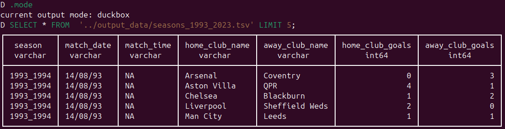
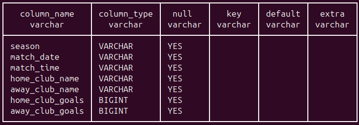

# Chapter 3 - Loading data into DuckDB

Now that we have created our source files, we need to upload them into a DuckDB database. In this chapter we will cover the DuckDB commandline client, the types of commands you can issue from it and perform an actual file import. Some topics such as schemas, dot commands and SQL statements are touched on but not discussed in detail but be assured that we will return to all of these topics in later chapters. The main objective now is just to get data into our DuckDB database. Once we have achieved this, we will be able to clean up and re-format the data as required in the following chapter. The exercises at the end of the chapter will give you more practice so please do try to complete them and only look at the answers if you get truly stuck.

## Before we start

I am assuming the following:

- You have installed DuckDB - to verify execute `which duckdb` from the unix terminal. If you get nothing back, then DuckDB is not installed or is not in your executables path.
- You have checked out the code from the GitHub repo


## Getting started

We now have our files ready for loading into DuckDB. Our DuckDB file is simply called _epl.ddb_. To load our data, we first need to create a DuckDB database which we can do very easliy by changing to the _db_files_ directory and executing the command:

```sh
duckdb epl.ddb
```

Executing this command now lands us in the _duckdb_ commandline client and you should see the _D_ prompt. You can now start issuing commands that the client will execute against the DuckDB database file. If you have used the SQLite _sqlite3_ client it will feel very familiar. However, even if you are new to it, it is not difficult to learn. The most important point to remember is that it takes two types of commands:

1. Dot commands: so called because they begind with a period (.). They are used to perform tasks such as listing all objects of a certain type such as tables, importing/exporting data and for setting certain DuckDB variables. From the client, try `.help` to see the options. Note that _nothing_, not even white space can precede the dot and the dot command is _not_ terminated by a semicolon.

2. SQL commands: These are standard DuckDB SQL commands and they are _not_ preceded by a dot but are terminated by a semi-colon. We will see loads of these throughout for creating tables, selecting/updating/deleting data and do on. When you enter a command in the DuckDB shell and hit return without the the terminating semi-colon, you will see the _secondary prompt_, ‣ whiich indicates that the client is waiting for additional input.

We will see plenty of examples of both types of commands as we progress. We will also see how to embed both types of commands in shell scripts.

If you exit the DuckDB client by issuing one of the dot commands _.q_ or _.quit_ without creating any objects, the database file will not be saved. If you create any content, even an empty table, the file named _epl.ddb_ will be created and saved.

## Importing our first file

We cannot do much with the data in DuckDB until we import it but first we can have a look at it before we do a full import.

### Explore before loading 

We are going to import the file _seasons_1993_2023.tsv_ which we generated using a shell script in the previous chapter. Before we import the file, we can take a "sneak peak" at it by executing the following command in the DuckDB client at the _D_ prompt:

```sql
SELECT * FROM  '../output_data/seasons_1993_2023.tsv' LIMIT 5;
```

You should see something that looks like the follwing in your teminal:



By default the output appears in what DuckDB calls _current output mode: duckbox_. You can verify this by issuing the `.mode` dot command. We will see later how to change this mode to customise outputs from queries.

Like the Unix _head_ command, the SQL query above shows all columns for the file. However, unlike _head_, by default it recognises the first row as the column names. To get the equivalent output from _head_, you woud need to execute `head -6 ../output_data/seasons_1993_2023.tsv`. The SQL query output also informs us that there are sevven columns and it has assigned data types to those columns. The data types are DuckDB guesses based on available data and we are free to change column data types to other compatible data types for particular columns which we will do later. There is also an exercise to practice re-setting modes.

The SQL command above is interesting because DuckDB is allowing to to select data directly from a file. I have not seen this feature in the RDBMs I am familiar with such as PostgreSQL, SQLite et cetera. It is one of many very convenient features that DuckDB provides and is really useful for exploring data. We will take advantage of many of these nifty features as we progress.

### Import the file

You can import files in the same way as in SQLite using the _.import FILE TABLE_ command but DuckDB has added some other more convenient ways to do this which we will exploit here.

### Schemas

Unlike SQLite but like PostgreSQL, DuckDB provides a _schemas_ which are convenient for dividing your database into logical units. Every DuckDB database has a default schema called _main_; in PostgreSQL the equivalent default schema is called _public_. They are somewhat like namespaces and allow us to group similar objects together. A common pattern in database programming is to load new and unverified data into a _staging_ area where it can be stored, analysed and manipulated before the data is transferred into another schema and integrated with other verified data for analysis. To create a schema we simply execute the _CREATE SCHEMA_ command and then switch to it like so:

```sql
-- Create a schema for holding newly uploaded data that is to be checked and re-formatted for analysis.
CREATE SCHEMA staging;
USE staging;
```

### Executing a data loading command

We are now going to create a table in the staging schema for the entire contents of the file _seasons_1993_2023.tsv_ by executing the following command:

```sql
CREATE TABLE seasons_1993_2023_raw AS 
SELECT * 
FROM  '../output_data/seasons_1993_2023.tsv';
```

Like many command commandline tools, when you execute a command, "no news is good news!". If all went well, you simply get back an empty prompt. That wasn't very difficult, in fact, DuckDB makes this kind of task trivial. We were able to create a table by simply selecting everything ( _SELECT * _) from an external text file. DuckDB does allow more fine-grained control over data imports using functions such as _read_csv_ that take options which we can explicitly set and we will cover such functions and their options in later chapters. We can verify that the table has loaded by doing a data row count as follows:

```sql
SELECT COUNT(*) loaded_row_count FROM seasons_1993_2023_raw;
```

This query informs us that 12641 rows were loaded. However, when we ran the `wc -l` Unix command on the input file, we got a row count of 12642. Pause for a moment to see if you can account for this discrepancy! Yes, we have a column name row which the DuckDB importer correctly guessed was the row for column names so it is not included in te database row count. We have therefore verified that all our rows have been loaded into the database.

### Examining the newly created table in depth

The _CREATE TABLE_ command above guessed correctly that our input file has a non-data column header row and that the columns are tab-separated. We have ended up with a table of seven columns and 12641 data rows. Using SELECT and LIMIT in SQL allows us to view the first rows in the table but we can go further and get a detailed view of the _structure_ of the table with respect to data types and unique column values using some quite straightforward SQL.

#### DESCRIBE the table

When you execute the following SQL, you should see the output shown in the figure below.

```sql
DESCRIBE seasons_1993_2023_raw;
```



The column names we added in our processing shell script were correctly used by DuckDB as table column names. The column types are more interesting; it has assigned type _VARCHAR_ to five of the seven columns. DuckDB's _VARCHAR_ type behaves like the _TEXT_ type in PostgreSQL which is convenient because it does not requires a length value as it does in many other database software where you need type declarations like _VARCHAR(50)_. It is also a general data type that can represent date values or numbers as text that can be converted to more appropriate types as needed. For example, we have a date column but DuckDB has interpreted the date strings as _VARCHAR_ and has not tried to be "clever" like Excel and do automatic type conversions! It has inferred a type of _BIGINT_ for the columns _home_club_goals_ and _away_club_goals_. DuckDB has many numeric types and it has correctly inferred an integer type for these columns; it has "played safe" by assigning the biggest integer type but common sense tells us no football score is ever going to need such large integers as this type allows. We will cast these columns to a more suitable integer type in the next chapter. I is always worth checking carefully what types DuckDB has inferred because if you expect a numeric type for a column and it assings a character type, then it may indicate mixed data types in the column or that the columns are not aligned correctly.

## Main points

- Discussed the two types of commands that you can execute in the DuckDB client
    1. Dot commands
    2. SQL commands
- Created the following DuckDB objects
    - A DuckDB database - _epl.ddb_
    - A schema within the database - _staging_
- Created a new DuckDB table _seasons_1993_2023_raw_ in the schema new schema
- Verified that both data row counts and the number of columns in the new table were as expected
- Used the _DESCRIBE_ command to get a convenient view of the table column names and data types.

## Exercises

1. The data for season 1992-1993 was not available in the main data source but we have the data in a _crosstab_ format in a file called _season_1992_1993.tsv_. Using the technique we discussed in the chapter, load this file into a table called _season_1992_1993_raw_ in the _staging_ schema.

2. Assuming you have loaded the file successfully, query it to answer the following questions:

    1. How many rows does it contain?
    2. How many columns does it contain?
    3. What are the data types assigned to each column?

3. Explore dot commands by doing the following:

    1. Read the SQLite documentation on them [here](https://www.sqlite.org/cli.html). It may seem odd to be consulting the documentation from another database software application but dot commands were borrowed directly from SQLite so its documentation is relevant.
    2. The _.mode_ command can be used to change the output from the default _duckbox_ to _markdown_. If you execute _.mode_ without and arguments, you will see the current mode. Change the mode to markdown and then select all columns from the _season_1992_1993_raw_ table as markdown. Re-set the mode to _duckbox.

4. Challenge: I mentioned earlier that you can use the SQLite _.import FILE TABLE_ to import a file into a DuckDB table. Try this using either of the data files we imported earlier. Unless you are already ecperienced in SQLite, you will need to read the relevant SQLite documentation to make this work.