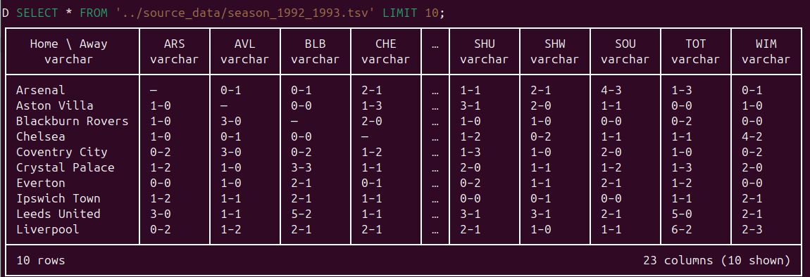

# Working with cross-tabbed input

The data giving match scores for season 1992-1993 was downloaded from Wikipedia as described in chapter 2. It is in a pivot format that uses row namess to represent the home club and column names to represent the away club with the intersection cell giving the score as home club goals scored followed by a dash of some sort followed by the away club goals scored.f subject of this book, of course, it could easily be done in a Python, Ruby etc but since DuckDB our main focus, let's do it using SQL in DuckDB.

What is the dash-like character separating the score in the data cells?

VS Code says:

"The character U+2013 "–" could be confused with the ASCII character U+002d "-", which is more common in source code"

What is "endash"?
https://stackoverflow.com/questions/59839683/en-dash-giving-different-ascii-values

## Task overview

Our objective is to create a new file in the format [FILL IN LATER]

## Importing the data

Let's first take a look at the first 10 rows:

```sql
SELECT * 
FROM '../source_data/season_1992_1993.tsv' 
LIMIT 10;
```
This shows us the first 10 rows and confirms that we have the expected 23 columns, as show below:



We can now import the table and get to work extracting its data into a more usable format. 

```sql
USE SCHEMA staging;
CREATE TABLE season_1992_1993_raw AS
SELECT * 
FROM '../source_data/season_1992_1993.tsv' ;
```

## Re-format season 1992-1993 data

Our final objective is to create a version of the data for this season which we can integrate with the data for all other seasons. We will do this step-wise and create intermediate tables at each step. Each intermediate table will be the input for the subsequent step. Once we have achieved our goal, we will remove the intermediate tables. Note, all of this activity takes place in the _staging_schema_.

### Un-pivoting

The DuckDB documentation on unpivoting is excellent: [UNPIVOT Statement](https://duckdb.org/docs/sql/statements/unpivot.html)

```sql
CREATE OR REPLACE TABLE season_1992_1993_unpivot AS
UNPIVOT season_1992_1993_raw
ON COLUMNS(* EXCLUDE "Home \ Away")
INTO
  NAME away_club_code
  VALUE score;
```

Notes on the above

### Beaking the scores into home and away columns

```sql
SELECT
FROM season_1992_1993_unpivot
WHERE LENGTH(score) = 1;
```

```sql
CREATE OR REPLACE TABLE season_1992_1993_scores AS
SELECT
  "Home \ Away" AS home_club_name,
  away_club_code,
  STRING_SPLIT(score, CHR(8211))[1] home_club_score,
  STRING_SPLIT(score, CHR(8211))[2] away_club_score
FROM season_1992_1993_unpivot;
```

### Remove self v self rows

The DELETE relies on the fact that rows where the home and away club is the same the second element returned by the _STRING_SPLIT_ function will be _NULL_.

Check the count before the delete:

```sql
SELECT COUNT(*)
FROM season_1992_1993_scores; -- -> 484
```

```sql
DELETE FROM season_1992_1993_scores
WHERE away_club_score IS NULL;
```

```sql
SELECT COUNT(*)
FROM season_1992_1993_scores; -- -> 462
```

We can now proceed with the CAST

### CAST scores to integer type

```sql
CREATE OR REPLACE TABLE season_1992_1993_int_scores
AS
SELECT
  home_club_name,
  away_club_code,
  CAST(home_club_score AS TINYINT) home_club_score,
  CAST(away_club_score AS TINYINT) away_club_score
FROM season_1992_1993_scores;
```

### Create the club name to club code lookup

```sql
CREATE OR REPLACE TABLE club_name_code_season_1992_1993_lu AS
SELECT 
  "Home \ Away" club_name,
  away_club_code club_code
FROM season_1992_1993_unpivot 
WHERE LENGTH(score) = 1;
```

### Jon tables to convert club name to club code

```sql
CREATE OR REPLACE TABLE season_1992_1993_ready AS
SELECT
  lu.club_code home_club_code,
  scores.away_club_code,
  scores.home_club_score,
  scores.away_club_score
FROM season_1992_1993_int_scores scores
  INNER JOIN club_name_code_season_1992_1993_lu lu
    ON scores.home_club_name = lu.club_name;
```

This table is now ready to be integrated with the data for the other seasons. We are missing the information on match date and time but we have successfully transformed our input crosstab fortmat into a much more usable form. I will make this point repeatedly: DuckDB really excels at this sort of task where we need to reshape data and pull strings apart. It is a tool par excellence for general data wrangling and data munging.